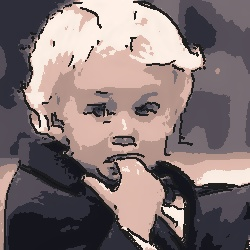
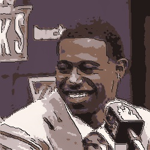
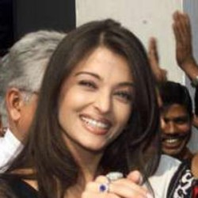
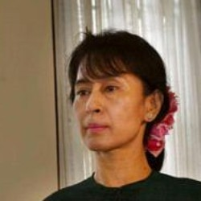

# Photo To NPR Image Generator

## Description

Automatically generates a non-photo-realistic image out of a real world photograph by producing a line sketch and reducing the palette of original colors. 

The baseline model achieves this by using Canny Edge Detection to produce the line sketch and K Means Clustering of the colors.

## Setup and Installation

- To install the dependancies, run

        pip install -r requirements.txt

- baselineModel.py depends on cannyLineSketch.py, kMeansColorPalette.py and depthBlend.py. To run the model on an image whose filename is <code>img.jpg</code>, the full path is not necessary. The input is relative to the data folder, and the output is saved as <code>Baseline_img.jpg</code> in the data folder.  

        python3 baselineModel.py img.jpg

## Sample Outputs

### Baseline Model

Input | Line Sketch | Colors | Output
:-:|:-:|:-:|:-:
 |  |  | 
 |  |  | 
 |  |  | 
 |  |  | 

### Final Model

Input | Line Sketch | Colors | Output
:-:|:-:|:-:|:-:
 |  |  | 
 |  |  | 
 |  |  | 
 |  |  | 

## Team Information
Team Name: iShowSpeed
- Sai Sriram Yannamani &emsp; 2019101029
- Raghav Raj Dwivedi &emsp; 2019101008
- Rishin Chakraborty &emsp; 2019112008
- Astitva Ranjan &emsp; 2019112025
- Rishu Anand &emsp; 2022802007

## Biblography:
- Original Paper: https://web.stanford.edu/class/ee368/Project_Winter_1819/Reports/teo_colas_deng.pdf
- Dataset: https://drive.google.com/file/d/1W782sqp0B4vFXX4Vo4Uux5zEk2jcpk3i/view?usp=sharing
